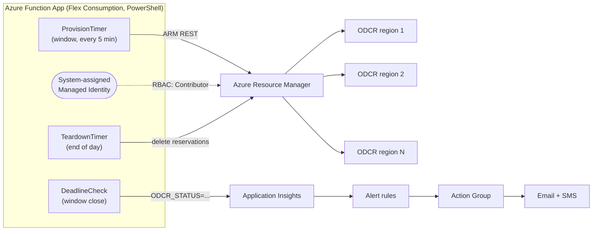

# SCR — Scheduled Capacity Reservation

> The automation layer that provisions **ODCRs/FCRs on a schedule, across regions** —
> reserving guaranteed capacity before your daily peak and releasing it afterward.

A serverless **Azure Functions** (PowerShell) solution that automatically acquires
**On-Demand Capacity Reservations (ODCRs)** across multiple Azure regions on a daily
schedule, retries through transient capacity shortages, reports the outcome via
email/SMS, and releases the capacity at end of day to control cost.

Originally built for a GPU exam-delivery workload that needs **guaranteed capacity**
during a fixed daily window, but the pattern applies to any workload that wants
capacity pre-provisioned before a peak.

---

## Why

On-demand GPU (and other constrained) SKUs can return `SkuNotAvailable` during peak
windows. An ODCR is Azure **physically setting aside hardware** for you. This app
acquires that reservation **in advance**, **in several regions at once** for
resilience, and **keeps retrying** until Azure fulfills it — then tears it down so you
only pay while you need it.

## What it does

- **Provision** every 5 minutes across the morning window, topping up toward a
  per-region target (the schedule provides a ~3-hour retry runway).
- **Parallel multi-region**: holds a reservation in **every** configured region
  simultaneously (or `fallback` mode: stop at the first region that succeeds).
- **Per-region sizing**: each region can request a different instance count.
- **Deadline check** at window close emits a final `ODCR_STATUS` signal
  (`FULFILLED` / `PARTIAL` / `FAILED`) that drives alerts.
- **Teardown** at end of day deletes the reservations (releasing the cost) while
  leaving the reservation groups for reuse.
- **Notifies** via Application Insights alert rules → email + SMS.

## Architecture



**Design highlights**

- **No secrets** — the app authenticates to ARM with its **managed identity** (needs
  `Contributor` on the target resource group). The core module calls the ARM REST API
  directly; no Az PowerShell modules required.
- **Idempotent & self-healing** — safe to run every few minutes; tops up partials,
  skips already-fulfilled regions, and classifies capacity errors as retryable vs
  terminal.
- **Config-driven** — regions, per-region counts, SKU, mode, and schedule are all app
  settings; no redeploy to reconfigure.

## Repository layout

```
Modules/Odcr.psm1     Core logic (ARM REST): provision, teardown, status, per-region targets
ProvisionTimer/       Timer trigger — provisions/tops up every N minutes across the window
DeadlineCheck/        Timer trigger — emits final ODCR_STATUS for alerting
TeardownTimer/        Timer trigger — releases reservations at end of day
ProvisionHttp/        HTTP trigger — manual provision (supports ?capacity= and ?retryMinutes=)
StatusHttp/           HTTP trigger — current per-region reservation status
TeardownHttp/         HTTP trigger — manual teardown
profile.ps1           Imports the module on worker startup
host.json             Functions host config (managed deps off, 10-min timeout)
requirements.psd1     Empty (no managed dependencies)
infra/                Bicep: function app + networking (VNet/PE/DNS/NAT) + alerts
```

## Configuration (app settings)

| Setting | Example | Purpose |
|---------|---------|---------|
| `ODCR_SUBSCRIPTION_ID` | `<guid>` | Target subscription |
| `ODCR_RG` | `odcr-demo-rg` | Resource group holding the reservation groups |
| `ODCR_GROUP` | `demoCRG` | Base name; each region becomes `demoCRG-<region>` |
| `ODCR_NAME` | `demoRes` | Base reservation name; becomes `demoRes-<region>` |
| `ODCR_SKU` | `Standard_NV6ads_A10_v5` | VM size to reserve (uniform across regions) |
| `ODCR_LOCATIONS` | `eastus,centralus,westus2` | Comma-separated region list |
| `ODCR_MODE` | `parallel` \| `fallback` | Hold all regions, or stop at first success |
| `ODCR_TARGET_CAPACITY` | `eastus:40,westus2:15,default:5` | Instances per region. Also accepts a plain integer for all regions. Regions not listed (and no `default`) are skipped. |
| `TZ` | `America/New_York` | Timezone for the cron schedules |

`ODCR_TARGET_CAPACITY` counts **VM instances**, not cores
(`total cores = instances × cores-per-SKU`).

### Schedules

Cron lives in each timer's `function.json` (`schedule`, NCRONTAB, 6-field). Defaults:

| Function | Cron | Meaning (in `TZ`) |
|----------|------|-------------------|
| `ProvisionTimer` | `0 */5 5-7 * * *` | Every 5 min, 5:00–7:55am |
| `DeadlineCheck` | `0 0 8 * * *` | 8:00am — final status + alerts |
| `TeardownTimer` | `0 0 19 * * *` | 7:00pm — release reservations |

## Prerequisites

- Azure subscription with **quota and capacity** for `ODCR_SKU` in each target region.
- [Azure Functions Core Tools v4](https://learn.microsoft.com/azure/azure-functions/functions-run-local)
- [Azure CLI](https://learn.microsoft.com/cli/azure/)
- PowerShell 7.x

## Deploy

1. **Provision infra** (function app, storage, networking, alerts):
   ```bash
   az deployment group create -g <rg> -f infra/main.bicep
   az deployment group create -g <rg> -f infra/networking.bicep
   az deployment group create -g <rg> -f infra/alerts.bicep \
     --parameters appInsightsName=<ai-name> alertEmail=you@example.com \
                  smsPhoneNumber=5551234567
   ```
2. **Grant the app's managed identity `Contributor`** on the resource group.
3. **Set app settings** from the table above.
4. **Publish the code:**
   ```bash
   func azure functionapp publish <function-app-name>
   ```

## Usage (manual triggers)

```bash
# Current per-region status
curl -s -X POST "https://<app>.azurewebsites.net/api/statushttp" \
  -H "x-functions-key: <key>"

# Provision now (optional override applies the same count to every region)
curl -s -X POST "https://<app>.azurewebsites.net/api/provisionhttp?capacity=5" \
  -H "x-functions-key: <key>"

# Release now
curl -s -X POST "https://<app>.azurewebsites.net/api/teardownhttp" \
  -H "x-functions-key: <key>"
```

## Local development

```bash
cp local.settings.sample.json local.settings.json   # fill in your values
func start
```
`local.settings.json` is gitignored — never commit real subscription IDs or secrets.

## Cost notes

- The Function App itself is near-zero on Flex Consumption (scales to zero).
- The real cost is the **reserved capacity**, held only during the daily window.
- Optional networking (private endpoints, NAT gateway) adds a small fixed monthly cost;
  remove `infra/networking.bicep` if your governance doesn't require private storage.

## Security

- Managed identity + RBAC only — **no keys or connection strings** in code or settings.
- Identity-based storage; the sample infra disables shared-key and public network access
  and uses private endpoints.

## License

[MIT](LICENSE)
